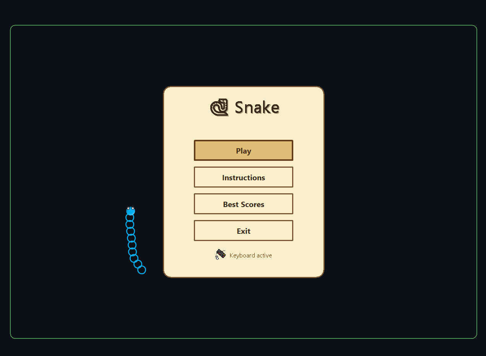
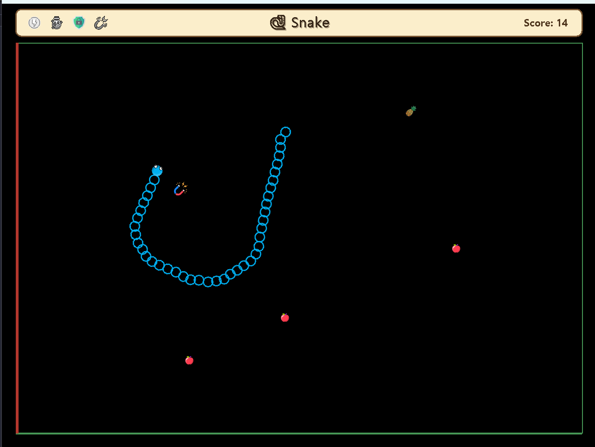

# 🐍 Snake Game

A modern and enhanced version of the classic **Snake**, focused on improving player–game interaction and overall gameplay fluidity.

The game introduces **free directional movement**, **dynamic border behavior**, **multiple fruit types**, and **impactful power-ups** that significantly change how each play session unfolds.

It supports both **keyboard** and **controller**, featuring automatic input switching to ensure seamless control at all times.

## Key Features

- Free movement based on smooth head rotation
- Dynamic borders with three states: Idle (green), Warning (yellow), Danger (red)
- Two fruit types: Apple (+1), Pineapple (+2)
- Four power-ups: Speed, Growth, Magnet, Shield
- Automatic keyboard ↔ controller input switching
- Quality-of-life handling for controller disconnect/connect
- Best Scores tracking and menu navigation support

## Screenshots

### Main Menu

### Gameplay

## Technical Highlights

- Custom game loop with separate **FPS** and **UPS**
- Modular architecture:
  - `entities`
  - `gameStates`
  - `inputs`
  - `utils`
  - `ui`
- Controller integration using **JNA** and **SDL**
- Clean update/draw cycle per state
- Object-oriented structure for game entities and power-ups

---

## 🎥 Gameplay Demo

👉 [Watch the demo video](demo/Snake_Game_Stan_Neagoe.mp4)
